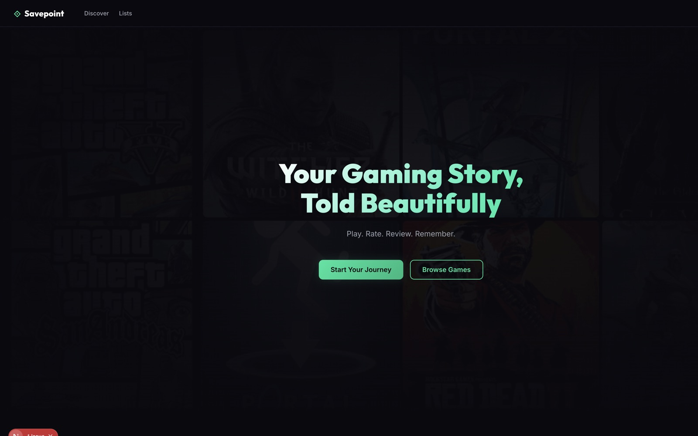
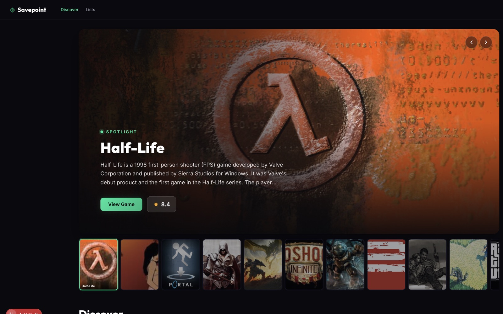

# Savepoint

**Play. Rate. Review. Remember.**

Savepoint is a social gaming platform for tracking your library, rating and reviewing titles, following friends, and discovering what to play next — Letterboxd-style, built for games.

<p align="center">
  
</p>

<p align="center">
  <em>Landing — Your Gaming Story, Told Beautifully</em>
</p>

<p align="center">
  
</p>

<p align="center">
  <em>Discover — Spotlight hero, trending rail, and the full IGDB catalog</em>
</p>

## What's inside

| Area | Highlights |
| --- | --- |
| **Discover** | IGDB-backed catalog, Spotlight carousel, Trending Now, personalized recommendations |
| **Library** | Status tracking, Steam sync, optional public libraries, community average playtime |
| **Social** | Follows, friends, curated lists, activity feed |
| **Chat** | Friend DMs with client-side E2E encryption and live polling |
| **Moderation** | Reports, admin tools, NSFW image scanning on uploads |

## Repository layout

```
Savepoint/
├── README.md              ← you are here
├── docs/                  ← screenshots used in this README
├── savepoint-srs.md       ← product / requirements notes
└── savepoint-app/         ← Next.js application (run the app from here)
```

The runnable app lives in [`savepoint-app/`](./savepoint-app/). See that folder’s [README](./savepoint-app/README.md) for install steps, env vars, and local development. Deployment notes are in [`savepoint-app/DEPLOY.md`](./savepoint-app/DEPLOY.md).

## Quick start

```bash
cd savepoint-app
npm install
cp .env.example .env   # fill in database, Auth, IGDB, etc.
npx prisma db push
npx prisma generate
npm run dev
```

Open [http://localhost:3000](http://localhost:3000).

## Tech stack

- **Next.js** (App Router) + TypeScript
- **PostgreSQL** (Supabase) + Prisma
- **Auth.js** (email, Google, Discord, Xbox)
- **IGDB** via Twitch API
- **Cloudflare R2** for avatars / banners
- Custom dark UI (vanilla CSS design system)

---

© 2026 Savepoint. Play. Rate. Review. Remember.
